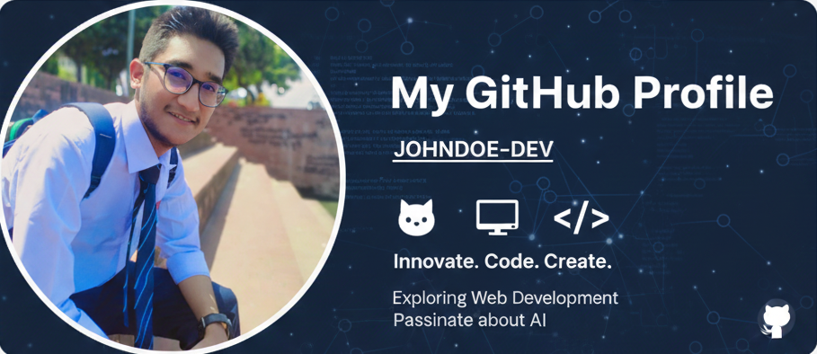

  

<h1 align="center">Hi 👋, I'm Sanzid Ahmed</h1>
<h4 align="center">Write code 💻 and make ideas into reality!</h4>

  Currently focused on modern web ecosystems and the bridge between Software & Robotics.

  
  
  

### 📝 About Me

| 🚀 **What I'm Doing** | 💡 **My Passions** |
| :--- | :--- |
| 🔹 Learning **MERN** (MongoDB, Express, React, Node) and building full-stack web projects. ⚡ Exploring **Next.js** for better web performance and SSR. 🏖️ Working on a **Tourism Website** using React and Tailwind CSS. 📈 Improving my **GitHub profile** with real-world projects. 🎓 Learning **AI & ML concepts** alongside university studies. | **Software Engineer** with a strong passion for **AI, ML & Robotics** 🤖 |

<h2 align="center">🛠️ Tech Stack</h2>

<h2 align="center">🌐 Web Development</h2>

| Skills Overview | Technology |
| :---: | :--- |
| Languages |  |
| Front-End Technologies |     |
| Back-End Technologies |   |
| Database |  |
| Tools & Platforms |   |

---

<h2 align="center">🚀 Featured Projects</h2>

  | # | Project Name | Description | Links |
| :---: | :--- | :--- | :---: |
| **1.** | **[AssetVerse](https://assetverse-119d3.web.app)** | A React-based web app that … (e.g., uses hooks and state management for a seamless user experience.) | [Live Demo 🌐](https://assetverse-119d3.web.app) \| [Code 🔗](https://github.com/Sanzid-Ahmed/ph-assignment-11-client) |
| **2.** | **[freemarket]( https://freemarket-5612f.web.app)** | MERN stack project for … (e.g., a simple task manager with CRUD operations and user authentication.) | [Live Demo 🌐]( https://freemarket-5612f.web.app) \| [Code 🔗]( https://github.com/Sanzid-Ahmed/ph-assignment-10-client) |
| **3.** | **[zapShift](https://yourprojecttwo.link)** | A JavaScript & HTML/CSS project that … (e.g., showcases pure DOM manipulation and dynamic content generation.) | [Live Demo 🌐](https://yourprojecttwo.link) \| [Code 🔗](https://github.com/Sanzid-Ahmed/project-two-repo) |
| **4.** | **[Project Four Name](https://yourprojectfour.link)** | Another project showcasing … (e.g., proficiency in responsive design and third-party API integration.) | [Live Demo 🌐](https://yourprojectfour.link) \| [Code 🔗](https://github.com/Sanzid-Ahmed/project-four-repo) |

***

---

<h2 align="center">✏️ Programming Foundations</h2>

| Language | Mastery & Topics | Practice Repos |
| :--- | :--- | :--- |
|  **C** | Fundamentals, Pointers, Structures | [Self](https://github.com/Sanzid-Ahmed/c-journey-practice) / [Uni 1](https://github.com/Sanzid-Ahmed/cse-1st-trimester-codes) / [Uni 2](https://github.com/Sanzid-Ahmed/cse-2nd-trimester-codes) |
|  **C++** | Competitive Programming, STL, OOP | *In Progress* |
|  **Java** | Basics to Multi-threading | *In Progress* |
|  **JS** | React.js & Modern Ecosystems | [View Projects](#-featured-projects) |

---

<h2 align="center">🌐 Connect with Me</h2>

  

  

  

